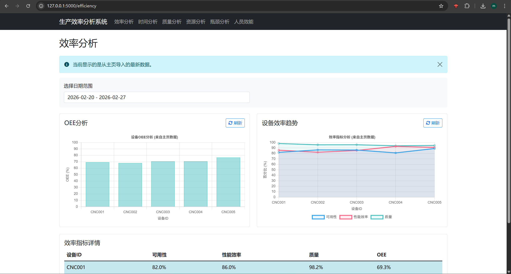
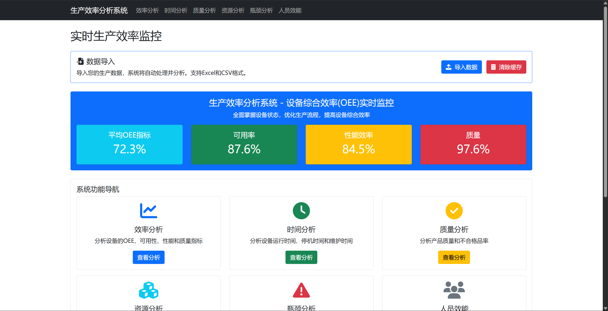
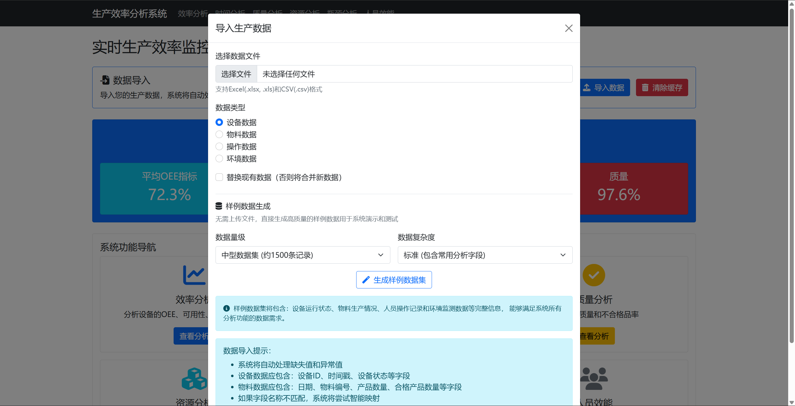
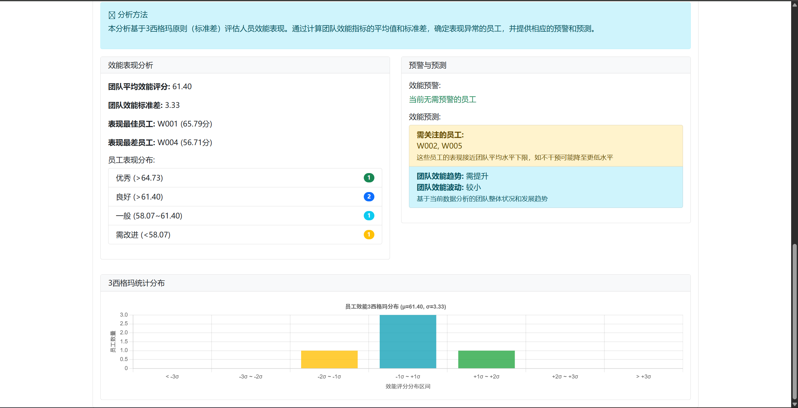
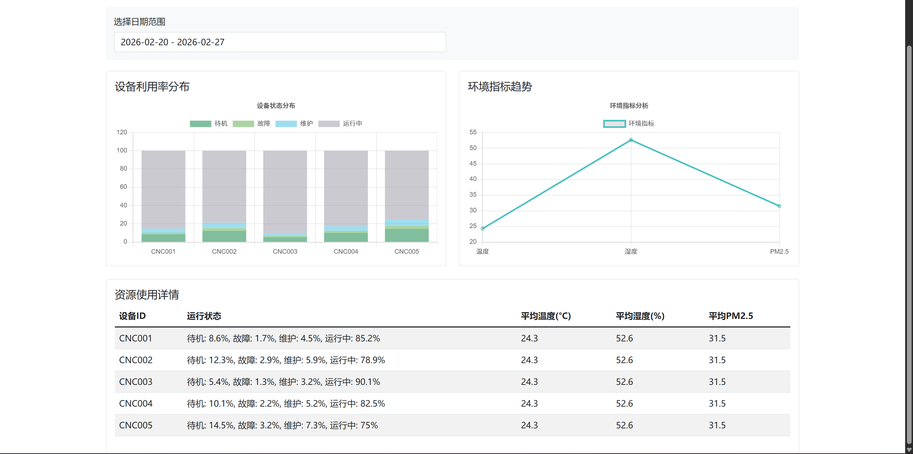
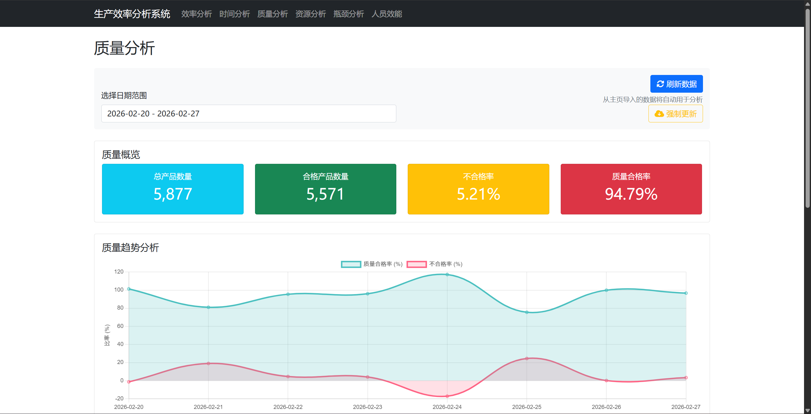

# 设备效能监控系统

## 项目概述
### 主要页面说明

- **首页（Dashboard）**：
  - 显示设备总览和关键指标概要
  - 实时设备状态监控面板
  - 最近预警信息列表
  - 系统操作快速入口
  
  

- **效率分析页**：
  - OEE分析图表及各要素详情
  - 设备效率对比分析
  - 历史趋势图
  - 效率改进建议
  
  

- **时间分析页**：
  - 设备时间利用分析
  - 运行时间、停机时间和维护时间分布
  - 停机原因Pareto分析
  - 时间利用率改进建议
  
  

- **质量分析页**：
  - 产品质量和缺陷分析
  - 良品率趋势
  - 缺陷原因分布
  - 过程能力指数(Cpk/Ppk)分析
  - 质量成本分析
  
  

- **资源分析页**：
  - 资源利用率分析仪表板
  - 设备利用率热力图
  - 物料消耗分析
  - 人员资源配置分析
  - 环境参数监控
  
  

- **瓶颈分析页**：
  - 生产瓶颈识别
  - 故障频率统计
  - 停机时长分析
  - 预警频率分析
  - 改进优先级建议
  
  

- **人员效能分析页**：
  - 操作人员效能分析
  - 技能水平评估
  - 人员效率雷达图
  - 培训需求识别
设备效能监控系统是一个用于实时监控、分析和优化生产设备运行效率的Web应用。系统通过采集和处理设备运行数据、人员操作记录、物料消耗及环境参数，提供多维度的效能分析，帮助制造企业发现生产瓶颈，优化生产流程，提高设备综合效率(OEE)。

本系统适用于制造业企业，尤其是使用CNC等数控设备的加工工厂，可帮助生产管理者实时了解设备运行状况，识别效率损失的主要原因，并针对性地提出改进建议。

### 主要功能

- **实时监控**：显示设备当前状态、运行参数和预警信息，支持设备状态变化实时通知
- **效率分析**：计算并展示OEE(设备综合效率)及其构成要素（可用性、性能效率和质量），提供历史趋势分析
- **时间分析**：分析设备运行时间、停机时间和维护时间分布，识别时间损失的主要原因
- **质量分析**：评估产品质量和缺陷原因，计算关键质量指标如良品率、缺陷分类，提供过程能力分析
- **资源分析**：监控设备、物料和人员资源利用率，优化资源分配和使用效率
- **瓶颈分析**：识别生产过程中的瓶颈和限制因素，帮助确定改进优先级
- **人员效能**：评估操作人员的工作效率、熟练度和技能水平，支持员工技能矩阵分析
- **数据导入**：支持从CSV和Excel文件导入生产数据，灵活适应不同的数据源格式

### 系统优势

- **综合分析**：从多个维度全面分析设备效能，而不仅限于单一指标
- **可视化展示**：直观的图表和仪表盘，使数据更易理解和决策
- **灵活配置**：可适应不同类型的设备和生产环境
- **无缝集成**：可与现有生产系统对接，通过数据导入功能融入现有工作流
- **离线使用**：支持离线数据分析，不依赖持续的网络连接
- **模拟数据**：内置模拟数据生成功能，便于系统测试和培训
- **开放扩展**：基于模块化设计，易于扩展新功能和分析维度

## 系统模块详解

系统由多个功能模块组成，每个模块负责特定的功能和数据处理任务：

### 1. 核心应用模块 (app.py)

作为系统的入口点，该模块负责：
- 初始化Flask Web应用和路由配置
- 管理用户请求和响应
- 协调其他模块的调用和交互
- 提供API接口服务
- 处理页面渲染和数据展示
- 维护应用状态和缓存策略

### 2. 数据模型模块 (models.py)

该模块定义了系统的数据结构和存储机制：
- 管理数据缓存和持久化
- 提供数据访问接口
- 定义设备、物料、人员和环境数据的结构
- 处理数据的加载和保存
- 管理系统指标的存储和检索

### 3. 业务服务模块 (services.py)

作为系统的业务逻辑核心，该模块负责：
- 实现OEE和其他效能指标的计算
- 处理设备状态监控和更新
- 提供数据分析和指标生成服务
- 管理历史数据的查询和聚合
- 生成模拟数据用于系统测试和演示
- 提供数据持久化和缓存管理服务

### 4. 数据处理模块 (data_processor.py)

专注于数据的处理和转换，该模块负责：
- 解析CSV和Excel格式的输入数据
- 数据清洗、标准化和验证
- 处理数据导入和格式转换
- 识别和修复数据中的问题（如缺失值、异常值）
- 提供数据预处理和特征工程功能
- 实现数据分析和过滤算法

### 5. 效率分析模块

专门用于评估设备综合效率(OEE)，该模块负责：
- 计算可用性、性能效率和质量三大要素
- 生成效率损失分析报告
- 提供效率趋势和对比分析
- 识别影响OEE的主要因素
- 生成改进建议和优先级排序
- 预测效率改进的潜在收益

### 6. 时间分析模块

聚焦于设备时间利用率分析，该模块负责：
- 分析设备运行时间、停机时间和维护时间
- 识别停机原因和频率
- 计算时间利用率和损失
- 分析各时间状态的趋势和模式
- 提供改进建议以减少非生产时间
- 评估计划内和计划外停机的影响

### 7. 质量分析模块

专门评估产品质量和缺陷，该模块负责：
- 计算良品率和缺陷率
- 分析缺陷类型和原因
- 评估过程能力指标(Cpk/Ppk)
- 计算质量相关成本
- 识别质量波动的趋势和模式
- 提供质量改进的建议和预测

### 8. 资源分析模块

聚焦于资源利用效率，该模块负责：
- 分析设备、物料和人员资源利用率
- 监控环境参数对生产的影响
- 识别资源浪费和优化机会
- 分析资源利用的季节性和周期性模式
- 提供资源分配优化建议
- 预测资源需求变化

### 9. 瓶颈分析模块

专门识别和分析生产瓶颈，该模块负责：
- 计算设备瓶颈指数和关键度
- 分析设备故障频率和影响
- 评估瓶颈对整体生产的限制作用
- 提供瓶颈消除的优先级排序
- 预测瓶颈改善的潜在收益
- 监控瓶颈变化和迁移情况

### 10. 人员效能模块

聚焦于人员绩效和技能评估，该模块负责：
- 计算操作人员的效率和熟练度
- 分析操作成功率和质量贡献
- 识别技能差距和培训需求
- 生成个人和团队效能报告
- 提供人员优化配置建议
- 跟踪培训效果和技能进步

### 11. 数据可视化模块

负责系统中所有数据的可视化展示，该模块：
- 生成交互式图表和仪表盘
- 提供多维度数据展示视图
- 支持数据钻取和过滤功能
- 实现实时数据更新和动态展示
- 提供自定义报表和导出功能
- 优化移动设备的数据展示体验

### 12. 异常检测和预警模块

专注于识别异常情况并发出预警，该模块负责：
- 持续监控设备状态和参数变化
- 使用统计和机器学习方法检测异常
- 评估异常的严重程度和影响范围
- 触发预警和通知机制
- 记录和分析历史异常模式
- 提供预测性维护建议

## 安装说明

### 环境要求

- Python 3.8+
- pip包管理器
- 建议系统内存 4GB 以上，以处理较大数据集
- 支持Windows、Linux和macOS操作系统

### 依赖安装

1. 克隆或下载本项目代码到本地
2. 在项目根目录下打开命令行
3. 运行以下命令安装所需依赖：

```bash
pip install -r requirements.txt
```

### 可选配置

可以通过修改`app.py`中的以下参数自定义系统行为：

- `VERBOSE_LOGGING`: 设置为`True`开启详细日志输出
- `UPLOAD_FOLDER`: 修改上传文件的存储目录
- `MAX_CONTENT_LENGTH`: 调整上传文件大小限制

## 使用方法

### 启动应用

在项目根目录下运行以下命令启动Flask应用：

```bash
python app.py
```

应用将在本地启动，默认访问地址为：http://127.0.0.1:5000/

在生产环境中，建议使用Gunicorn或uWSGI等WSGI服务器部署：

```bash
# 使用Gunicorn部署（Linux/Mac）
gunicorn -w 4 -b 0.0.0.0:5000 app:app

# 使用uWSGI部署
uwsgi --http 0.0.0.0:5000 --wsgi-file app.py --callable app --processes 4 --threads 2
```

### 数据导入

系统支持两种数据获取方式：

1. **使用内置示例数据**：系统默认使用模拟生成的数据进行演示，可通过首页的"生成示例数据"按钮重新生成
2. **导入自定义数据**：通过Web界面的"数据导入"功能上传CSV或Excel格式的数据文件

#### 导入数据的格式要求

- **设备数据格式**：
  - 必须字段：`设备ID`, `时间戳`, `设备状态`
  - 推荐字段：`总运行时间`, `故障次数`, `预警状态`
  - 示例行：`CNC001, 2023-01-01 08:00:00, 运行中, 125.3, 0, 正常`

- **物料数据格式**：
  - 必须字段：`日期`, `物料编号`, `产品数量`, `合格产品数量`
  - 示例行：`2023-01-01, CNC001, 150, 147`

- **人员操作数据格式**：
  - 必须字段：`工号`, `时间戳`, `设备ID`, `操作类型`
  - 推荐字段：`操作时长`, `操作结果`, `熟练度`
  - 示例行：`W001, 2023-01-01 08:15:00, CNC001, 上料, 1.2, 正常, 0.85`

- **环境数据格式**：
  - 必须字段：`传感器ID`, `时间戳`, `温度`, `湿度`
  - 推荐字段：`PM2.5`, `位置`, `预警状态`
  - 示例行：`TEMP001, 2023-01-01 08:00:00, 23.5, 55.2, 35.6, 车间A区, 正常`

#### 导入步骤

1. 点击系统界面中的"数据导入"按钮
2. 选择数据类型（设备数据/物料数据/人员操作数据/环境数据/全部数据）
3. 选择是否替换现有数据
4. 选择要上传的文件（CSV或Excel格式）
5. 点击"上传"按钮开始导入
6. 查看导入结果和数据统计信息

### 主要页面说明

- **首页（Dashboard）**：
  - 显示设备总览和关键指标概要
  - 实时设备状态监控面板
  - 最近预警信息列表
  - 系统操作快速入口

- **效率分析页**：
  - OEE分析图表及各要素详情
  - 设备效率对比分析
  - 历史趋势图
  - 效率改进建议

- **时间分析页**：
  - 设备时间利用分析
  - 运行时间、停机时间和维护时间分布
  - 停机原因Pareto分析
  - 时间利用率改进建议

- **质量分析页**：
  - 产品质量和缺陷分析
  - 良品率趋势
  - 缺陷原因分布
  - 过程能力指数(Cpk/Ppk)分析
  - 质量成本分析

- **资源分析页**：
  - 资源利用率分析仪表板
  - 设备利用率热力图
  - 物料消耗分析
  - 人员资源配置分析
  - 环境参数监控

- **瓶颈分析页**：
  - 生产瓶颈识别
  - 故障频率统计
  - 停机时长分析
  - 预警频率分析
  - 改进优先级建议

- **人员效能分析页**：
  - 操作人员效能分析
  - 技能水平评估
  - 人员效率雷达图
  - 培训需求识别

### 使用案例

#### 案例1：识别和改进OEE损失

1. 访问"效率分析"页面，查看OEE指标及其构成
2. 识别OEE中最薄弱的环节（如可用性较低）
3. 根据分析结果，前往相应页面（如"时间分析"）深入研究
4. 确定主要问题（如频繁的短时停机）
5. 实施改进措施并持续监控效果

#### 案例2：人员技能提升

1. 访问"人员效能"页面，查看各操作人员的技能评分
2. 识别技能差距较大的操作类型
3. 制定针对性的培训计划
4. 实施培训后，通过系统持续监控技能水平变化

#### 案例3：质量问题分析

1. 当产品质量出现波动时，访问"质量分析"页面
2. 查看质量趋势及缺陷分类
3. 结合"环境分析"数据，识别可能的外部因素影响
4. 制定质量改进措施并评估效果

## 项目结构

```
设备效能监控系统/
├── app.py                 # 主应用入口，Flask应用配置
├── models.py              # 数据模型定义
├── services.py            # 业务逻辑服务
├── data_processor.py      # 数据处理模块
├── requirements.txt       # 项目依赖
├── formulas.md            # 计算公式文档
├── architecture.md        # 系统架构设计文档
├── README.md              # 项目说明文档
├── data/                  # 数据存储目录
│   └── test_data.xlsx     # 测试数据文件
├── uploads/               # 上传文件临时目录
├── static/                # 静态资源
│   ├── css/               # 样式文件
│   ├── js/                # JavaScript文件
│   └── images/            # 图片资源
└── templates/             # HTML模板
    ├── index.html         # 首页模板
    ├── efficiency.html    # 效率分析页
    ├── time.html          # 时间分析页
    ├── quality.html       # 质量分析页
    ├── resource.html      # 资源分析页
    ├── bottleneck.html    # 瓶颈分析页
    └── staff.html         # 人员效能分析页
```

### 核心文件说明

- **app.py**: 应用主入口，包含Flask路由和API定义
- **models.py**: 数据模型和缓存机制
- **services.py**: 业务逻辑服务，包含指标计算和数据处理
- **data_processor.py**: 数据导入和处理逻辑
- **formulas.md**: 系统使用的所有计算公式详细说明
- **architecture.md**: 系统架构设计和技术选型说明

## API接口文档

系统提供以下RESTful API接口，全部以JSON格式返回数据：

### 状态与指标API

- **GET `/api/status/latest`**
  - 功能：获取最新设备状态数据
  - 返回：设备状态、环境状态和预警信息

- **GET `/api/metrics/latest`**
  - 功能：获取所有设备的最新指标
  - 参数：
    - `refresh`: (可选) 设置为"true"强制刷新数据
    - `clear_cache`: (可选) 设置为"true"清除缓存
  - 返回：所有设备的OEE指标及其组成部分

- **GET `/api/metrics/latest/<device_id>`**
  - 功能：获取指定设备的最新指标
  - 参数：`device_id` - 设备ID
  - 返回：该设备的OEE指标及其组成部分

- **GET `/api/metrics/<device_id>/<days>`**
  - 功能：获取指定设备的历史指标
  - 参数：
    - `device_id` - 设备ID
    - `days` - 历史天数
  - 返回：指定天数内该设备的每日OEE指标

### 分析API

- **POST `/api/efficiency`**
  - 功能：获取效率分析数据
  - 参数：
    - `start_time`: 开始日期 (YYYY-MM-DD)
    - `end_time`: 结束日期 (YYYY-MM-DD)
  - 返回：各设备的可用性、性能效率、质量和OEE指标

- **POST `/api/time-analysis`**
  - 功能：获取时间分析数据
  - 参数：
    - `start_time`: 开始日期 (YYYY-MM-DD)
    - `end_time`: 结束日期 (YYYY-MM-DD)
  - 返回：运行时间、停机时间、维护时间和利用率数据

- **POST `/api/quality-analysis`**
  - 功能：获取质量分析数据
  - 参数：
    - `start_time`: 开始日期 (YYYY-MM-DD)
    - `end_time`: 结束日期 (YYYY-MM-DD)
    - `stable`: (可选) 设置为"true"使用稳定模拟数据
    - `cache_key`: (可选) 缓存标识键
  - 返回：质量率、缺陷分析、过程能力指数等数据

- **POST `/api/resource-analysis`**
  - 功能：获取资源分析数据
  - 参数：
    - `start_time`: 开始日期 (YYYY-MM-DD)
    - `end_time`: 结束日期 (YYYY-MM-DD)
  - 返回：设备利用率、环境参数和资源利用率数据

- **POST `/api/bottleneck-analysis`**
  - 功能：获取瓶颈分析数据
  - 参数：
    - `start_time`: 开始日期 (YYYY-MM-DD)
    - `end_time`: 结束日期 (YYYY-MM-DD)
  - 返回：设备故障、停机时间和预警频率数据

- **POST `/api/staff-efficiency`**
  - 功能：获取人员效能分析数据
  - 参数：
    - `start_time`: 开始日期 (YYYY-MM-DD)
    - `end_time`: 结束日期 (YYYY-MM-DD)
  - 返回：操作时长、熟练度、成功率和效率得分数据

### 数据管理API

- **POST `/api/import-data`**
  - 功能：导入数据文件
  - 参数：
    - `dataFile`: 文件对象
    - `dataType`: 数据类型 (equipment/material/operation/environment/all)
    - `replace`: 是否替换现有数据 (true/false)
  - 返回：导入结果和统计信息

- **GET `/api/data/equipment`**
  - 功能：获取原始设备数据
  - 返回：设备数据记录集

- **GET `/api/data/material`**
  - 功能：获取原始物料数据
  - 返回：物料数据记录集

- **GET `/api/data/operation`**
  - 功能：获取原始人员操作数据
  - 返回：操作数据记录集

- **GET `/api/data/environment`**
  - 功能：获取原始环境数据
  - 返回：环境数据记录集

- **GET `/api/force-regenerate-and-update`**
  - 功能：强制重新生成示例数据
  - 参数：
    - `data_size`: 数据量大小 (small/medium/large)
    - `complexity`: 复杂度 (simple/normal/complex)
    - `sample`: 是否为样本数据 (true/false)
  - 返回：生成结果和统计信息

## 常见问题解答

### 1. 系统无法启动，提示"模块未找到"错误

确保已正确安装所有依赖:
```bash
pip install -r requirements.txt
```

检查Python版本是否为3.8或更高:
```bash
python --version
```

### 2. 导入数据失败

- 确保数据格式符合要求，包含所有必须字段
- 检查日期格式是否为标准格式 (YYYY-MM-DD 或 YYYY-MM-DD HH:MM:SS)
- CSV文件请确保使用UTF-8编码
- Excel文件请确保使用.xlsx格式（非.xls）

### 3. 没有显示数据或图表

- 检查是否已导入数据或使用示例数据
- 确认所选日期范围内有数据
- 尝试清除浏览器缓存或使用隐私模式
- 使用系统的"清除缓存"功能刷新数据

### 4. 数据分析结果不符合预期

- 检查原始数据是否准确
- 查看formulas.md了解计算公式详情
- 确认数据的完整性，缺失数据可能导致计算偏差
- 联系开发团队获取支持

## 项目文档

- **formulas.md** - 包含系统中使用的所有计算公式，详细说明每个指标的计算方法
- **architecture.md** - 描述系统的核心架构、设计原则和技术选型

## 贡献指南

欢迎对本项目进行贡献！您可以通过以下方式参与：

1. 报告Bug或提出功能建议
2. 提交代码改进或新功能
3. 完善文档和使用示例
4. 分享使用经验和最佳实践

## 许可证

本项目采用MIT许可证。详情请参阅LICENSE文件。

## 联系方式

如有任何问题或建议，请联系项目维护者。 